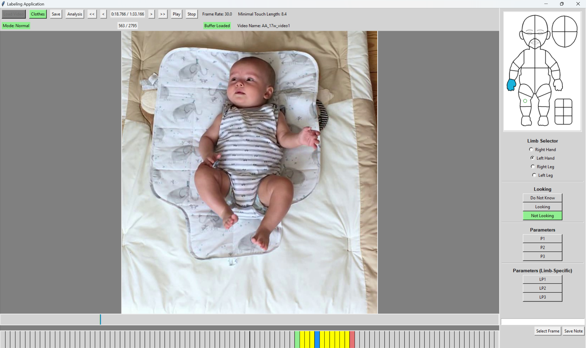

# Self-contact Coding Application version 5.5

## Introduction

This application is designed for behavioral researchers to code self-contact (self-touch) in videos.

## How to Use

### Step 1: Download and Extract the ZIP File

1. **Download** the ZIP file containing the application. (In the repository click on **Releases** (on the right side) and then download **touch-coderx_x.zip**)
2. **Extract** the contents of the ZIP file into a folder on your computer.

### Step 2: Run the Application

1. Open the extracted folder.
2. Double-click on `LabelingApplicationx_x.exe` to launch the application.

## Application Workflow

1. **Prepare Video and Frames:**

   - After the GUI loads you can start by clicking on `Load Video`.
   - You will be asked to select if you want to normaly label of if you want to do the reliability.
   - If you have selected new video the application will extract frames (it can take some time).

2. **Select Clothing Zones:**
   - Click on the `Clothes` button to select the zones that are covered with clothes.
   - The data will be saved after closing the `Clothes` window.
3. **Navigate Through Frames:**

   - Use the left and right arrow keys, the mouse wheel or the buttons next to the current frame number to move between frames.
   - You can also navigate by clicking in the Timeline 1 or Timeline 2.

4. **Select Limb:**

   - Choose a limb using the radio buttons located under the diagram.

5. **Code Touches:**

   - You can mark start of a touch by left-clicking on the diagram (a green dot will appear).
   - Mark end of a touch by right-clicking (a red dot will appear).
   - Middle-click on a dot to remove it (you can also aim on the dot and press `d` on your keyboard).
   - Touches will be indicated by a yellow color on the Timeline.
   - You can also add additional information by using `Looking` and `Parameter` buttons.
   - You can add note by writing into `Note Entry` and clicking on `Save Note`.

6. **Save Labeled Touches:**

   - Periodically save your work by clicking the `Save` button.
   - You can find the labeled data in `Labeled_data/name_of_video/data/export/name_of_video_export.csv`

7. **Close the Application:**
   - The application will automatically save your data when you close it.

### Watch the Tutorial

The tutorial was created for now a bit outdated version but might still help.
[Watch the tutorial video (download it)](./assets/tutorial.mp4)

## Additional Notes

- **New Template:**

  - by changing parameter `new_template` in the `config.json` to `true` you can label on the new template"

- **Infant’s Gaze:**

  - Indicate whether the infant is looking, not looking, or if you’re unsure. This only needs to be entered once per touch. The state is indicated by the green color of the corresponding button.

- **Parameters:**

  - Parameters names can be customized by editing `config.json`. They can be used to for example track if parent is present or whatever you want.

- **Boxes:**

  - Six boxes on the diagram can be used to label touches of ground or whatever you want.

- **Reliability:**

  - by selecting the `reliability` mode the saved files will end with `_reliability`.

- **Performance Tips:**

  - If you experience performance issues, consider making the application window smaller. Smaller pictures will load faster.

- **Opening Data Files:**

  - Please avoid opening `.csv` and other files during labeling.

- **Labeling Multiple Videos:**

  - After labeling one video, close the application before opening a new one.

- **Loading Indicator:**

  - If you see a red `Buffer Loading` label instead of a green `Buffer Loaded` label, just wait a bit for the section to load.

- **Terminal Window:**
  - A terminal window will open with the application. Do not close it. If you encounter a bug, describe it and send a picture of the terminal window. It may contain error messages that will help with debugging.

## Bugs

- **Timeline Issues:**
  - Sometimes, the timeline may not turn yellow as expected. However, the touch still exists if you see green and red dots.

## Contact information

navarlu2@fel.cvut.cz

## Related publications

Example of analysis based on this type of coding is:
Khoury, J., Popescu, S. T., Gama, F., Marcel, V. and Hoffmann, M. (2022), Self-touch and other spontaneous behavior patterns in early infancy, in 'IEEE International Conference on Development and Learning (ICDL)', pp. 148-155. [link to pdf](https://drive.google.com/file/d/1iVgMr-8eJFPH8jU31ksDNmv4xWY_4s5q/view?usp=sharing)
