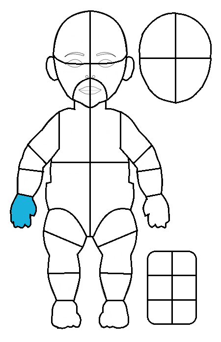
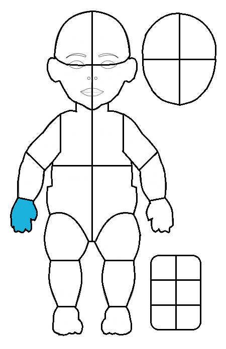

# TinyTouch Annotation Guide

A coding manual for annotators. It assumes you have TinyTouch installed (see the
[README](../README.md)) and have never used it before. If you need the exact structure of
the files it produces, read [DATA_FORMAT.md](DATA_FORMAT.md) instead.

**Contents**

1. [What you are coding](#1-what-you-are-coding)
2. [Labeling modes: Normal and Reliability](#2-labeling-modes-normal-and-reliability)
3. [Loading a video](#3-loading-a-video)
4. [The window](#4-the-window)
5. [Marking clothing](#5-marking-clothing)
6. [Coding a touch](#6-coding-a-touch)
7. [Zones](#7-zones)
8. [Gaze and parameters](#8-gaze-and-parameters)
9. [Notes](#9-notes)
10. [Saving](#10-saving)
11. [Analysis](#11-analysis)
12. [Practical tips and common mistakes](#12-practical-tips-and-common-mistakes)

---

## 1. What you are coding

For each of the infant's four limbs — **RH** (right hand), **LH** (left hand), **RL**
(right leg), **LL** (left leg) — you mark every episode in which that limb is in contact
with the infant's own body, and where on the body the contact happens.

An episode is two events:

- an **onset** on the first frame where the contact is established, and
- an **offset** on the first frame where the contact has ended.

Both events also carry the contact **location**, which you indicate by clicking the
matching place on the body diagram. TinyTouch converts the click into a zone name
automatically.

The duration of a touch is `offset frame − onset frame`: the touch is counted as active on
the onset frame and *not* on the offset frame. The shortest touch you can code is one
frame long.

---

## 2. Labeling modes: Normal and Reliability

Every time you press **Load Video** you are asked to choose a mode.

**Normal** — ordinary coding. The project folder is named after the video.

**Reliability** — a second, independent pass over a video that has already been coded, used
to compute inter-rater agreement. Choose it when you are re-coding someone else's video (or
your own, blind) so the two datasets can be compared instead of overwriting each other:

- The project folder gets a `_reliability` suffix (`data/infant_042_reliability/`), so the
  original dataset is untouched.
- The **frames are copied from the original project** rather than re-extracted, so the two
  passes see byte-identical images and frame indices line up exactly.
- `Labeling Mode` in the export metadata records which pass produced the file.

The mode chip in the bottom-left corner of the window shows which mode you are in; it turns
amber in Reliability mode. Your choice is remembered as the default for next time.

---

## 3. Loading a video

1. Click **Load Video** and pick `Normal` or `Reliability`, then **Continue**.
2. Select the video file (`.mp4`, `.mov`, `.avi`, `.mkv`, `.flv`, `.wmv`).
3. TinyTouch copies the video into the project's `videos/` folder so the working set is
   self-contained. A progress window shows the copy.
4. It then extracts every frame to `data/<video>/frames/`. **This takes a while on a long
   video and only happens once**; a later session on the same video reuses the frames.
   In Reliability mode the frames are copied from the original project instead.
5. Any existing annotations for that project are loaded, and you resume at the frame you
   left off on.

Do not close the terminal window that opens alongside the application. It carries the log,
and if something goes wrong a screenshot of it is what makes the problem diagnosable.

---

## 4. The window

**Left** — the video frame, and below it two timelines.

- **Timeline 1** (the taller one) shows the current block of 100 frames for the
  **currently selected limb**, one cell per frame: green = a frame carrying an onset, red =
  a frame carrying an offset, pale green = frames inside an open touch, grey = nothing
  coded. Cells past the end of the video are hatched. Thin vertical ticks mark frames where
  a global or limb parameter is set. A playhead marks the current frame.
- **Timeline 2** (the slimmer one, above it) spans the whole video and acts as a scrub bar.

Clicking either timeline jumps to that frame.

**Right** — the body diagram, the limb selector, the parameter buttons and the note box.

**Top bar** — Load Video, Settings, Clothes, Analysis, Save on the left; the navigation
buttons, Play/Stop and the frame/time counters on the right.

**Bottom strip** — the mode chip, the buffer indicator, the minimal-touch-length readout,
the jump size, and the video name. A red **Buffer: Loading** indicator means the decoded
frames around your position are still being read; wait a second and it turns green.

### Keyboard and mouse

| Input | Action |
| --- | --- |
| `←` / `→` | Previous / next frame |
| `Shift`+`←` / `Shift`+`→` | Jump back / forward by the fast-jump distance |
| Mouse wheel | Previous / next frame |
| `Space` | Toggle Play / Stop |
| **Left-click** on the diagram | Mark a touch **onset** at that point (green dot) |
| **Right-click** on the diagram | Mark a touch **offset** at that point (red dot) |
| **Middle-click** on the diagram | Delete the dot nearest the pointer on the current frame |
| `d` | Same as middle-click, using the last pointer position over the diagram |
| Click on Timeline 1 or Timeline 2 | Jump to that frame |
| `<<` / `<` / `>` / `>>` buttons | Fast-jump back, back one, forward one, fast-jump forward |
| **Play** / **Stop** buttons | Start / stop playback |
| **Save** button | Write the state database and the export |

The fast-jump distance is set in Settings as **Fast-jump seconds** and is converted to a
frame count using the video's frame rate; the current value is shown as `Jump: N` in the
bottom strip.

Navigation keys are ignored while the cursor is inside the note box, so typing a note that
contains a `d` or an arrow key does not move you off the frame.

---

## 5. Marking clothing

Click **Clothes** to open the clothing dialog. It shows the whole-body diagram.

- **Left-click** places a dot on a covered zone.
- **Middle-click** removes the nearest dot.
- **Save** stores the current dots; **Save & Close** stores them and closes the dialog.

The zones under the dots are resolved with the same masks used for touch coding, and the
resulting list is written to the export metadata as `Zones Covered With Clothes`. Do this
once, before you start coding, so downstream analysis knows which contacts were
skin-to-skin and which were through clothing.

---

## 6. Coding a touch

1. **Select the limb** with the radio buttons under the diagram (Right Hand, Left Hand,
   Right Leg, Left Leg). The diagram redraws with that limb's zone map, and the timeline
   switches to that limb. Annotations for the other three limbs are untouched — you code
   one limb at a time, but all four coexist in the same project.
2. **Find the first frame of the contact** with the arrow keys or the wheel.
3. **Left-click on the body diagram at the place being touched.** A green dot appears and
   the frame is marked as an onset for the selected limb.
4. **Step forward to the first frame where the contact has ended.**
5. **Right-click at the place the limb was touching last.** A red dot appears and the frame
   is marked as an offset. The touch is now closed.

While a touch is open, the onset's dot is redrawn as a hollow green ring on later frames as
a reminder of where the touch started and that it is not yet closed.

**Several clicks on one frame.** You may click more than once on the same frame for the
same limb — for example when a hand spans two zones, or when you want to record several
contact points. All clicks on that frame are stored, each with its own zone. The
onset/offset state, however, belongs to the whole frame-and-limb: the most recent click
sets it. Do not left-click and then right-click on the same frame for the same limb
expecting two events; you will end up with one offset frame carrying two dots.

**The limb moves during a touch.** If the contact drifts to a different zone without
breaking, you can click (with either button, on an intermediate frame) to record the new
location. Clicks on frames inside an open touch are recorded as mid-touch waypoints and
appear in the trajectory plot. Note that a left-click inside an open touch counts as an
extra onset — this is what the "touch length distribution" histogram counts — while a
right-click closes the touch.

**Deleting.** Middle-click near a dot, or hover over it and press `d`, to remove it. The
dot must be within roughly 20 pixels of the pointer. Removing the last dot on a frame also
clears that frame's onset/offset state for the limb, so the frame goes back to being blank.

---

## 7. Zones

You never type a zone name. TinyTouch determines it from where you clicked, using a set of
per-zone mask images that exactly overlay the body diagram.

- The **default zone set** has 38 zones: `A`–`Z`, `WB`, `XB`, `YB`, `ZB`, six boxes, `LINE`
  and `OUTSIDE`.
- The **alternate zone set** (`"new_template": true` in `config.json`) has 32: `A`–`T`,
  `QB`, `RB`, `SB`, `TB`, six boxes, `LINE` and `OUTSIDE`. It uses a different body diagram,
  so the same letter means different anatomy. Agree on one template before a study starts
  and record which one you used.

Both diagrams are shipped as figures you can print for reference:

| Default template | Alternate template |
| --- | --- |
|  |  |

Special zones:

- **`BOX1`–`BOX6`** — the six boxes drawn beside the body. They are catch-alls with no
  built-in meaning: use them for contacts with something that is not the infant's body
  (the ground, a toy, the caregiver's hand). Decide what each box means in your coding
  scheme and write it down, because the export only records `BOX3`, not what you meant by
  it.
- **`OUTSIDE`** — you clicked in the area masked as off-body.
- **`LINE`** — you clicked exactly on a boundary line between two zones, and *no zone at all
  covers that pixel*, so TinyTouch genuinely cannot tell which one you meant. Nudge the click
  a pixel or two into the intended zone.
- **`NN`** — **no zone matched at all.** Almost always a misclick outside the diagram's
  masked area. `NN` clicks are kept in the data and show up in the analysis, so treat `NN`
  in a finished dataset as a defect to be corrected, not as a category. Every `NN` click is
  also announced with a `WARN` line in the console, naming the frame and limb, so you can
  fix it while you are still on the video.

The zone masks overlap slightly, so a click can match several. The winner is decided by
precedence, not by name: **a real body zone beats a box, a box beats `OUTSIDE`, and
`OUTSIDE` beats `LINE`.** That is why `LINE` and `NN` really mean "nothing claimed this
pixel" and are worth chasing down — they are never just an artifact of which zone happens
to sort first.

---

## 8. Gaze and parameters

Below the diagram there are two groups of three buttons.

**Parameters (limb-specific)** — apply to the currently selected limb on the current frame.

**Parameters (global)** — apply to the whole frame, regardless of the selected limb.

Every button is a three-state toggle. Clicking it cycles:

```
unset  →  ON  →  OFF  →  unset  →  ...
```

The button is colored to show the state, and the state of the current frame is reflected
whenever you move between frames.

**Gaze** is recorded with **global Parameter 1**, which the shipped configuration labels
`Looking1`. Set it to `ON` when the infant is looking at the contact, `OFF` when the infant
is demonstrably not looking, and leave it unset when you cannot tell. In practice you only
need to set it once per touch, on the onset frame, unless your coding scheme says otherwise.

**The button labels are configurable.** Open **Settings** and edit the three global and the
three limb-specific parameter labels. They are stored in `config.json` and written into the
export metadata (`Param Labels`, `Limb Param Labels`) so a reader can tell what
`Parameter_2` meant in your study. **The column names in the export do not change** — they
stay `Parameter_1..3` and `{limb}_Parameter_1..3`. Agree on the labels before coding
starts; changing them mid-study leaves you with one metadata file describing both halves.

Settings also holds the display options: video downscale (lower = faster), diagram scale,
dot size, the fast-jump distance, and whether holding an arrow key plays at the video's real
frame rate. Changes apply on **Apply** or **Apply & Close**.

---

## 9. Notes

The text box at the bottom right stores one free-text note per frame.

- Type the text and click **Save Note**. The note is attached to the frame you are on and
  reappears when you return to it.
- Saving an empty box clears the note.
- **Select Frame** reuses the same box as a "go to frame" field: type a frame number and
  click it to jump there. Remember that this consumes whatever is in the box, so do not
  leave a half-typed note in it.

Notes end up in the `Note` column of the export, one per frame.

---

## 10. Saving

Click **Save** regularly. Saving:

1. writes your annotations to the project's working database
   (`data/<video>/state/<video>.db`), and
2. rewrites the published dataset,
   `data/<video>/export/<video>_export.csv` plus `<video>_metadata.json`.

TinyTouch also saves automatically before loading another video and when you close the
window. A progress dialog appears during the export; on a long video this takes a few
seconds.

Practical rules:

- **Do not open the CSV in Excel while labeling.** A file lock can make a save fail.
- **Close the application before starting another video** if you can; loading a second
  video in the same session works, but a fresh start is the well-trodden path.
- The application keeps a labeling-time counter per video and reports it in the metadata as
  `Total Labeling Time (hours)`.

---

## 11. Analysis

**Analysis** saves first, then computes per-limb statistics from the export and writes an
interactive dashboard to `data/<video>/plots/`, opening the index page
(`master_<video>.html`) in your browser. It contains:

- a **touch-trajectory plot**, one panel per limb, showing every click drawn over the limb
  diagram — green for the onset, red for the offset, black for mid-touch waypoints;
- a **summary table**: touch counts, total and mean duration, standard deviation, percentage
  of the video spent touching, touch rate per minute;
- **transition heatmaps**, one per limb, counting start zone → end zone;
- two **histograms**: number of onsets per touch, and touch duration.

Two things to read carefully:

- Heatmap totals can exceed the number of touches. A touch whose onset resolved to two
  zones and whose offset resolved to two zones contributes four counts, by design.
- Any **open (unterminated) touch** is reported separately in the table and in a warning
  banner at the top of the page, and is excluded from every duration statistic. If that
  count is not zero, go and fix the data — see below.

The `Minimal Touch Length` readout in the app is a visual aid only. It never filters
anything, in the app or in the analysis.

---

## 12. Practical tips and common mistakes

**An `ON` without a matching `OFF` is the most common error.** It is easy to mark an onset,
get distracted, and never close the touch — or to delete an offset dot and forget to
replace it. Such a touch is **unterminated**: it has no duration, and it is excluded from
totals, means, standard deviations, percentages, transition counts and both histograms. It
is not silently dropped — the analysis reports it separately with its start frame, in the
summary table, in the banner on the dashboard page and in the log — but it contributes
nothing to your statistics. **Run Analysis before you consider a video finished and check
that the "Open (Unterminated) Touches" column is zero for all four limbs.** Then jump to the
reported start frame and add the missing offset.

**A stray `OFF` is silently ignored.** An offset with no preceding onset belongs to no
touch. It appears nowhere in the statistics and produces no warning, so it is harder to
notice than a missing offset. Work forward through the video in order rather than jumping
around, and you will rarely create one.

**Check the selected limb before you click.** Nothing stops you from coding a right-hand
touch onto the left leg. The limb selector and the timeline are the only cues; get into the
habit of coding one limb through the whole video before switching.

**Do not left-click twice where you meant onset then offset.** The second left-click adds a
point and keeps the frame marked as an onset. Onset is left, offset is right, always.

**Watch for `NN` and `LINE`.** Both mean your click did not land cleanly inside a zone.
Delete the dot and click again a little further from the boundary.

**Set the parameter labels before the study, not during it.** They are recorded once, in
the metadata of whatever save happened last.

**Coordinates are independent of the diagram scale**, so changing the diagram size mid-study
does not shift previously stored clicks. Dot size and video downscale are equally
display-only.

**If the frame looks stale, check the buffer indicator.** A red `Buffer: Loading` means the
frames around your position are still being read from disk; the display catches up on its
own.

**If something goes wrong**, do not close the terminal window — it holds the log. Save a
screenshot of it along with a description of what you were doing.

---

## See also

- [../README.md](../README.md) — installation and a short quick start.
- [DATA_FORMAT.md](DATA_FORMAT.md) — the exact structure and semantics of the exported
  files.
